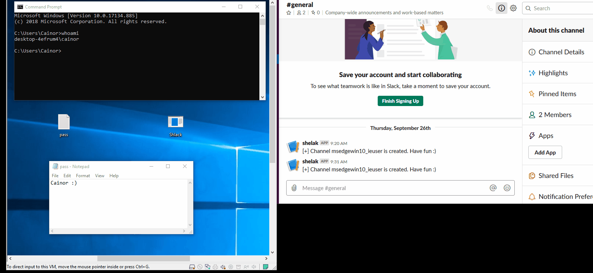

# Shlack
Make your Slack group a C2 server :)
Shlack = Shell + Slack

## Features
1. Traffic is HTTPS encrypted, using Slack's crtificate.
2. Your IP can only be tracked by Slack's team.
3. Supports multiple targets by creating a new channel for each target.

## How it works
The payload connects to the Slack group you made using the BotToken and the OauthToken, doing the following:
1. The payload creates a new channel in Slack group. The channel name is created using "hostname_username".
2. Keeps listening to commands sent through the created channel.
3. Output of the command is sent back to you as a massege in the channel.
4. **If you have multiple victims, the commands are sent to all victims. But only the intended victim will execute the command.**

## Requirments
For this to work you must have the following:
1. A Slack group. (Duhh!)
2. A Slack app.
3. Add the app to the group.
4. Add the app to the channel created by the victim. (This is important so that the messages sent through the channel is received by the shell)
5. Give the app the following permissions from "OAuth & Permissions" section:
   - channels:history
   - channels:write
   - bot
   - search:read
   
 ## Python vs C#
 - Python supports Windows and Linux. C# Support only Windows.
 - Python require "python 3.6" and slackclient module to be installed. C# requires .Net Framework 4.5
 - Python size after turning it to exe is more than 10MB. C# size is 255KB.

## Demo

